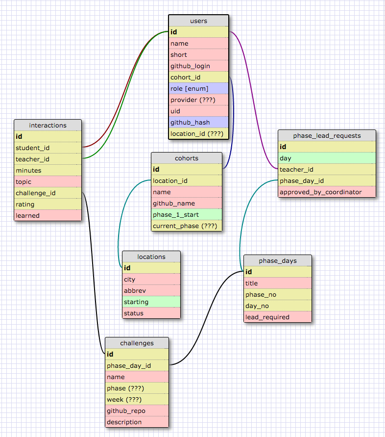

DBC Teacher
===========

Schema
------


Ruby on Rails
-------------
This application requires:

- Ruby 2.0.0
- Rails 4.2.6

Getting Started
---------------
* Create your own [local Github auth app](https://github.com/settings/applications/new)
  * Set Authorization callback URL to http://localhost:3000/auth/github/callback
* Create an application.yml file in config/ with

```
development:
  OMNIAUTH_PROVIDER_KEY: [Your new key]
  OMNIAUTH_PROVIDER_SECRET: [Your new secret]
```

Create a database.yml file in config/ with:
```
development:
  adapter:  postgresql
  host:     localhost
  encoding: unicode
  database: dbc-teacher_development
  pool:     5
  username: [YOURS]
  password: [YOURS]
  template: template0

test:
  adapter:  postgresql
  host:     localhost
  encoding: unicode
  database: dbc-teacher_test
  pool:     5
  username: [YOURS]
  password: [YOURS]
  template: template0
```

and then create and seed the db with
```
bundle exec rake db:setup
```

To run all specs:
```bundle exec rspec spec/```

To start the server, while watching for changes:
```bundle exec guard```